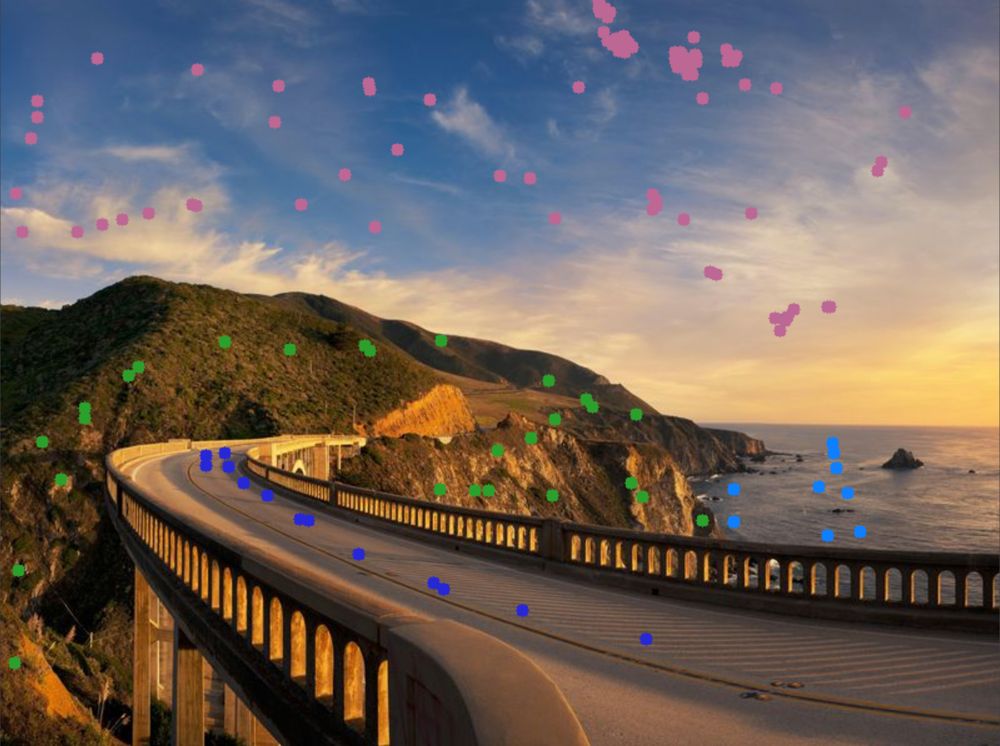
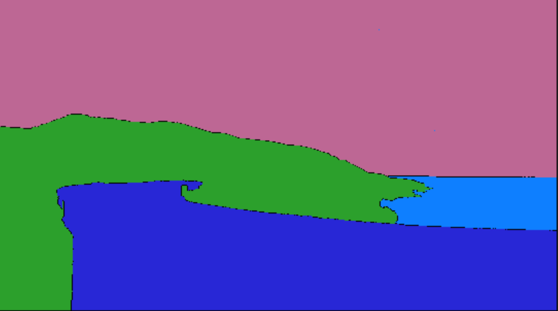

# Watershed-Segmentation-Algorithm
A small project on the watershed segmentation algorithm with OpenCV. This project is interactive so that you can dot the picture and let the segmentation algorithm do its magic.

# How to use the interactive algorithm:

-Press where ever you please in the image to start segmenting
-To change segmentation marker press a number between "1-9" (1 is set as default segmentation marker)
-To reset the watershed segmentation press "C" 
-To quit press "esc" (escape-key)

#Example:

This is a dotted image using the interactive platform:

This is the results from dotting and letting the watershed algorithm infer the segmentation from it:

